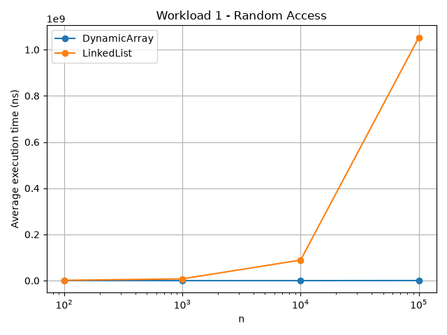
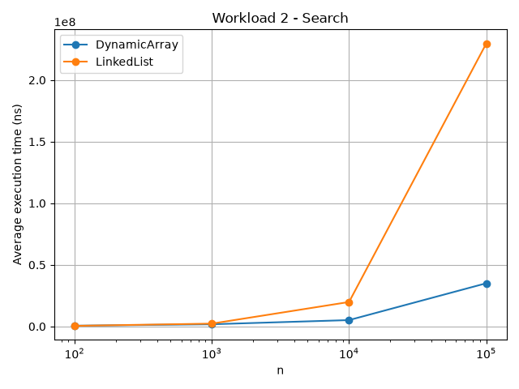
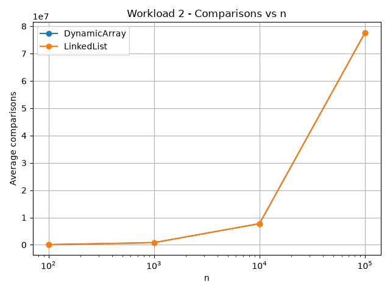
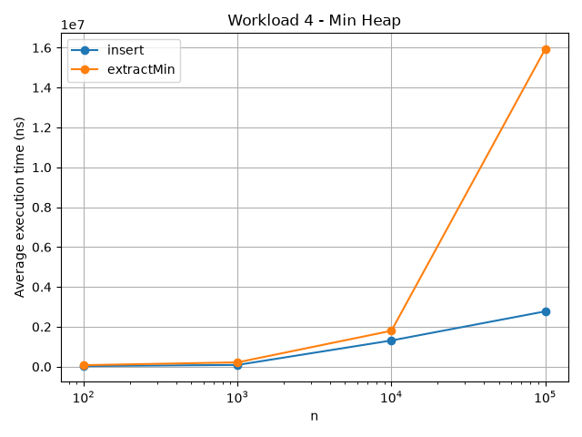

# Assignment 2 — Data Structures and Performance

## 1. Overview

This project implements three data structures in Java:

- Dynamic Array
- Linked List
- Min-Heap

The goal is to compare their theoretical complexity with real benchmark results.

The project contains:

```text
assignment-2/
├── src/
│   ├── DynamicArray.java
│   ├── LinkedList.java
│   ├── MinHeap.java
│   ├── Benchmark.java
│   └── Tests.java
├── results/
│   ├── tables/
│   └── plots/
├── plot_results.py
└── README.md
```

## 2. Complexity Analysis

### Dynamic Array

| Operation | Best | Average | Worst |
| --- | --- | --- | --- |
| `add(x)` | Θ(1) | Θ(1) amortized | O(n) |
| `add(index, x)` | Ω(1) | Θ(n) | O(n) |
| `remove(index)` | Ω(1) | Θ(n) | O(n) |
| `get(index)` | Θ(1) | Θ(1) | Θ(1) |
| `contains(x)` | Ω(1) | Θ(n) | O(n) |

`get(index)` is fast because an array supports direct access by index.

Insertion and removal can be slower because elements may need to be shifted.
When the internal array is full, a bigger array is created and the old elements are copied.

### Linked List

| Operation | Best | Average | Worst |
| --- | --- | --- | --- |
| `add(x)` | Ω(1) | Θ(n) | O(n) |
| `add(index, x)` | Ω(1) | Θ(n) | O(n) |
| `remove(index)` | Ω(1) | Θ(n) | O(n) |
| `get(index)` | Ω(1) | Θ(n) | O(n) |
| `contains(x)` | Ω(1) | Θ(n) | O(n) |

The list stores nodes connected with references.

Accessing an element by index requires moving from the head through the nodes. Insertion and removal at index `0` are fast because only the `head` reference changes.

### Min-Heap

| Operation | Best | Average | Worst |
| --- | --- | --- | --- |
| `insert(x)` | Ω(1) | O(log n) | O(log n)* |
| `peekMin()` | Θ(1) | Θ(1) | Θ(1) |
| `extractMin()` | Ω(1) | O(log n) | O(log n) |

\* A resize of the backing array can make one `insert` operation O(n), but normal heap adjustment is O(log n).

For index `i`:

```text
left child  = 2*i + 1
right child = 2*i + 2
parent      = (i - 1) / 2
```

The minimum value is always stored at index `0`.

## 3. Correctness

### 3.1 Dynamic Array — `add(index, value)`

The method shifts elements one position to the right before inserting the new value.

**Loop invariant:** before every iteration, the elements already processed on the right side are in their correct new positions and keep their original order.

**Initialization:** before the first iteration, no element has been moved yet, so the invariant is true.

**Maintenance:** each iteration copies `data[i - 1]` to `data[i]`. One more element is moved to the correct position, while already moved elements stay correct.

**Termination:** when the loop finishes, all elements from the insertion position to the end have been shifted right. The new value can then be written at `index`.

Therefore the insertion is correct.

### 3.2 Min-Heap — `insert(value)`

A new value is first added at the end of the heap and then moved upward if it is smaller than its parent.

**Loop invariant:** before each iteration, the heap property is correct everywhere except possibly between the current node and its parent.

**Initialization:** the old heap was valid. Adding one new leaf can only create a problem between the new node and its parent.

**Maintenance:** if the current node is smaller than its parent, they are swapped. The only possible remaining problem is now one level higher.

**Termination:** the loop stops when the node reaches the root or is no longer smaller than its parent. At that point the complete heap satisfies the min-heap property.

Therefore `insert(value)` is correct.

## 4. Experimental Setup

The benchmarks use the following input sizes:

```text
100
1,000
10,000
100,000
```

Each experiment is run **5 times**, and the average execution time is reported.

Timing is measured with:

```java
System.nanoTime()
```

A fixed random seed is used:

```java
new Random(42)
```

Input data is generated before the timed section.

### Workload 1 — Random Access

Structures: Dynamic Array and Linked List.

For every `n`, 10,000 random indices are generated and `get(index)` is executed for each one.

Measured values:

- execution time;
- number of accesses.

### Workload 2 — Search

Structures: Dynamic Array and Linked List.

For every `n`, 1,000 search values are generated and `contains(value)` is executed.

Measured values:

- execution time;
- number of comparisons.

### Workload 3 — Insertion and Removal

Structures: Dynamic Array and Linked List.

The benchmark performs insertion and removal:

- at index `0`;
- near index `n / 2`.

Measured values:

- execution time;
- movements for Dynamic Array;
- node accesses for Linked List.

### Workload 4 — Priority Processing

Structure: Min-Heap.

For every `n`:

1. Insert `n` random integers.
2. Measure insertion time.
3. Extract all elements with `extractMin()`.
4. Measure extraction time.
5. Count comparisons.
6. Verify that extracted values are in non-decreasing order.

## 5. Results

Benchmark tables are stored in:

```text
results/tables/
```

Plots are stored in:

```text
results/plots/
```

Main plots:

### Random Access



### Search



### Search Comparisons



### Heap



> Add a short paragraph here after running the benchmark with your actual measured results.

## 6. Discussion

### Random Access

Dynamic Array should perform better for random access because `get(index)` is Θ(1).
Linked List must move through nodes, so its access time grows with `n`.

### Search

Both structures use linear search, so both have Θ(n) average search complexity.
However, Dynamic Array can still be faster in practice because its elements are stored close together in memory.

### Insertion and Removal

At the beginning of a Dynamic Array, many elements must be shifted.

A Linked List can insert or remove at the beginning by changing only a few references, so these operations are Θ(1).

For middle positions, both structures usually require linear work. The Dynamic Array moves elements, while the Linked List traverses nodes.

### Min-Heap

A Min-Heap is useful when the smallest-priority element must be processed repeatedly.

`peekMin()` is constant time, while insertion and extraction normally require at most logarithmic heap adjustment.

### Theory vs Practice

Real execution time can differ from theoretical complexity because of:

- JVM/JIT behavior;
- cache effects;
- memory allocation;
- garbage collection;
- constant factors;
- background system activity.

This is why operation counts are useful together with execution time.

## 7. Design Recommendations

**Dynamic Array** is a good choice when:

- fast random access is important;
- most additions are at the end;
- iteration speed matters.

**Linked List** can be useful when:

- insertion/removal at the beginning is frequent;
- random indexed access is not important.

**Min-Heap** is a good choice when:

- elements are processed by priority;
- the minimum element must be found quickly.

## 8. Conclusion

The experiments show that the best data structure depends on the workload.

Dynamic Array is strong for indexed access, Linked List can be useful for beginning insertions/removals, and Min-Heap is suitable for priority-based processing.

The assignment also shows that Big-O complexity is important, but real performance is affected by implementation and memory behavior as well.

## Build and Run

Compile and run tests:

```bash
javac src/*.java
java -cp src Tests
```

Run benchmarks:

```bash
java -cp src Benchmark
```

Generate plots:

```bash
python plot_results.py
```
